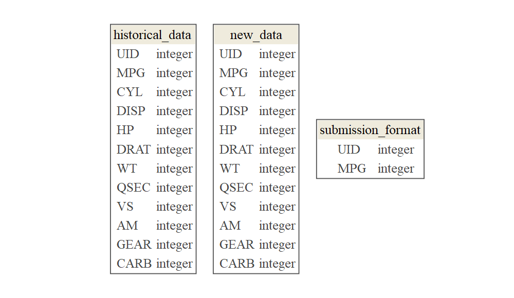

# `template.project` 

<!-- badges: start -->

[](https://www.r-project.org/)
[](https://travis-ci.org/data-science-competitions/template.project)
[](https://codecov.io/github/data-science-competitions/template.project/?branch=master)
[](https://mybinder.org/v2/gh/data-science-competitions/template.project/master?urlpath=rstudio)
<!-- badges: end -->

<!-- Package Title -->

R Project Template for Analytic
Applications

-----


<!-- Package Description -->

## Description

Using this template reduces:  
\* Unnecessary variance between projects configurations; and  
\* Development time spent on making a barebone project working for the
first time.  
This is possible as the boilerplate comes with:  
\* Fully configured test-suite, including code-coverage; and  
\* Fully configured continuous-integration (CI) script for Travis.

## Useage

1.  Create a new repo on GitHub.
2.  Use the
    [`git-flow`](https://blog.sourcetreeapp.com/2012/08/01/smart-branching-with-sourcetree-and-git-flow/)
    approach in your development cycle.
3.  Create a new release named `inception`.
4.  Copy `template.project` content to the new reposetory.
5.  Change the `template.project.Rproj` file to `<package-name>.Rproj`.
6.  Open the `DESCRIPTION` file, and edit the following fields:
7.  **Package** modify the package name while using the `tidylab.`
    prefix.
8.  **Title** modify the package title; use uppercase words with no
    period (‘.’).
9.  **URL** modify the package URL such that it leads to its GitHub
    repo.
10. **BugReports** edit the URL such that it leads to the package issue
    page.
11. **Description** modify the package decription.
12. In `README.Rmd` delete the **Useage** Section.
13. Render `README.Rmd` by clicking the **Knit** button.
14. Push changed on the `inception` branch.
15. Go to [Travis website](https://travis-ci.org/account/repositories),
    add the project and enable its integration.

## Installation

`template.project` accommodates two stages in the project life-cycle:
Development and Production.

### Working in Pseudo-Package Mode (Advised During Development Stage)

1.  Download the project to local computer
2.  Launch the project via `template.project.Rproj`
3.  Optional: Install all package
dependencies

<!-- end list -->

``` r
remotes::install_local(dependencies = TRUE, force = TRUE, upgrade = "always")
devtools::uninstall()
```

4.  Load the complete project as a package via `devtools::load_all()` or
    Ctrl+Shift+L

### Working in Package Mode (Advised During Production Stage)

    install.packages("devtools")
    devtools::install_github("data-science-competitions/template.project")

## Data Pipeline

The template includes a database abstraction layer (DAL) that separates
data sources and analytic applications. The DAL has three stages with
the following functionality:

1.  `Ingest`

<!-- end list -->

  - Pull data from external sources; and
  - Matching schema, organizing, indexing, encoding and compressing the
    data.

<!-- end list -->

2.  `Prepare`

<!-- end list -->

  - Type conversion of variables if necessary; and
  - Data cleansing;

<!-- end list -->

3.  `Store`

<!-- end list -->

  - Create a data model if relational tables exist;
  - Introduce new features and ready-for-modelling tables; and
  - Make the data available for query.

The template provides skeletons for `Ingest`, `Prepare` and `Store`
interfaces. In addition, the template includes a toy example which
demonstrates the data flow between all three interfaces.

<!--
### Ingest Layer Interface and its Implementation


```r
ingest_abstract <- Ingest$new(path = tempdir())
class(ingest_abstract)

ingest_concrete <- IngestDAO$new(path = tempdir())
class(ingest_concrete)
```

### Prepare Layer Interface and its Implementation


```r
prepare_abstract <- Prepare$new()
class(prepare_abstract)

prepare_concrete <- PrepareDAO$new()
class(prepare_concrete)
```

### DataStore Object


```r
ds <- DataStore$new()
class(ds)
```
-->

## Datasets

### Accessing the Project Data

``` r
ds <- DataStore$new()
names(ds$data_model)
```

    ## [1] "historical_data"   "new_data"          "submission_format"

### Data Overview

    ## -- Table source ----------------------------------------------------------------------------------------------
    ## src:  <PrepareDAO>
    ## -- Data model ------------------------------------------------------------------------------------------------
    ## Data model object:
    ##   3 tables:  historical_data, new_data, submission_format 
    ##   26 columns
    ##   2 primary keys
    ##   1 references
    ## -- Rows ------------------------------------------------------------------------------------------------------
    ## Total: 42
    ## historical_data: 22, new_data: 10, submission_format: 10



<!--
### Data Model


-->

### Data Glimpse

    ## ---
    ## historical_data

    ## Observations: 22
    ## Variables: 12
    ## $ UID  <chr> "Mazda RX4", "Mazda RX4 Wag", "Datsun 710", "Hornet 4 Drive", "Hornet Sportabout",...
    ## $ MPG  <dbl> 21.0, 21.0, 22.8, 21.4, 18.7, 18.1, 14.3, 24.4, 22.8, 19.2, 17.8, 16.4, 17.3, 15.2...
    ## $ CYL  <dbl> 6, 6, 4, 6, 8, 6, 8, 4, 4, 6, 6, 8, 8, 8, 8, 8, 8, 4, 4, 4, 4, 8
    ## $ DISP <dbl> 160.0, 160.0, 108.0, 258.0, 360.0, 225.0, 360.0, 146.7, 140.8, 167.6, 167.6, 275.8...
    ## $ HP   <dbl> 110, 110, 93, 110, 175, 105, 245, 62, 95, 123, 123, 180, 180, 180, 205, 215, 230, ...
    ## $ DRAT <dbl> 3.90, 3.90, 3.85, 3.08, 3.15, 2.76, 3.21, 3.69, 3.92, 3.92, 3.92, 3.07, 3.07, 3.07...
    ## $ WT   <dbl> 2.620, 2.875, 2.320, 3.215, 3.440, 3.460, 3.570, 3.190, 3.150, 3.440, 3.440, 4.070...
    ## $ QSEC <dbl> 16.46, 17.02, 18.61, 19.44, 17.02, 20.22, 15.84, 20.00, 22.90, 18.30, 18.90, 17.40...
    ## $ VS   <dbl> 0, 0, 1, 1, 0, 1, 0, 1, 1, 1, 1, 0, 0, 0, 0, 0, 0, 1, 1, 1, 1, 0
    ## $ AM   <dbl> 1, 1, 1, 0, 0, 0, 0, 0, 0, 0, 0, 0, 0, 0, 0, 0, 0, 1, 1, 1, 0, 0
    ## $ GEAR <dbl> 4, 4, 4, 3, 3, 3, 3, 4, 4, 4, 4, 3, 3, 3, 3, 3, 3, 4, 4, 4, 3, 3
    ## $ CARB <dbl> 4, 4, 1, 1, 2, 1, 4, 2, 2, 4, 4, 3, 3, 3, 4, 4, 4, 1, 2, 1, 1, 2

    ## ---
    ## new_data

    ## Observations: 10
    ## Variables: 12
    ## $ UID  <chr> "AMC Javelin", "Camaro Z28", "Pontiac Firebird", "Fiat X1-9", "Porsche 914-2", "Lo...
    ## $ MPG  <dbl> 15.2, 13.3, 19.2, 27.3, 26.0, 30.4, 15.8, 19.7, 15.0, 21.4
    ## $ CYL  <dbl> 8, 8, 8, 4, 4, 4, 8, 6, 8, 4
    ## $ DISP <dbl> 304.0, 350.0, 400.0, 79.0, 120.3, 95.1, 351.0, 145.0, 301.0, 121.0
    ## $ HP   <dbl> 150, 245, 175, 66, 91, 113, 264, 175, 335, 109
    ## $ DRAT <dbl> 3.15, 3.73, 3.08, 4.08, 4.43, 3.77, 4.22, 3.62, 3.54, 4.11
    ## $ WT   <dbl> 3.435, 3.840, 3.845, 1.935, 2.140, 1.513, 3.170, 2.770, 3.570, 2.780
    ## $ QSEC <dbl> 17.30, 15.41, 17.05, 18.90, 16.70, 16.90, 14.50, 15.50, 14.60, 18.60
    ## $ VS   <dbl> 0, 0, 0, 1, 0, 1, 0, 0, 0, 1
    ## $ AM   <dbl> 0, 0, 0, 1, 1, 1, 1, 1, 1, 1
    ## $ GEAR <dbl> 3, 3, 3, 4, 5, 5, 5, 5, 5, 4
    ## $ CARB <dbl> 2, 4, 2, 1, 2, 2, 4, 6, 8, 2

    ## ---
    ## submission_format

    ## Observations: 10
    ## Variables: 2
    ## $ UID <chr> "AMC Javelin", "Camaro Z28", "Pontiac Firebird", "Fiat X1-9", "Porsche 914-2", "Lot...
    ## $ MPG <dbl> 0, 0, 0, 0, 0, 0, 0, 0, 0, 0

<!--
## Function Dependencies


-->
