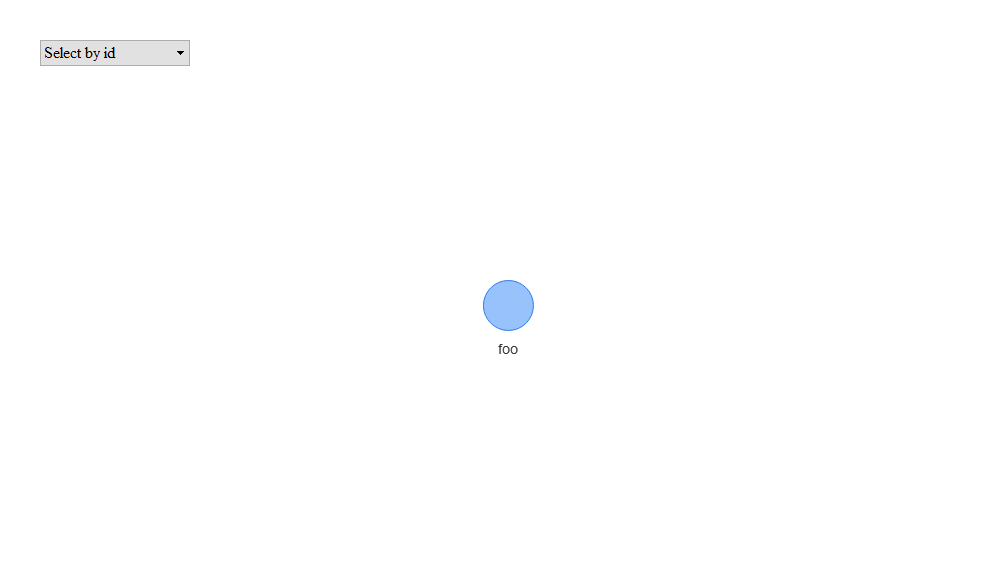
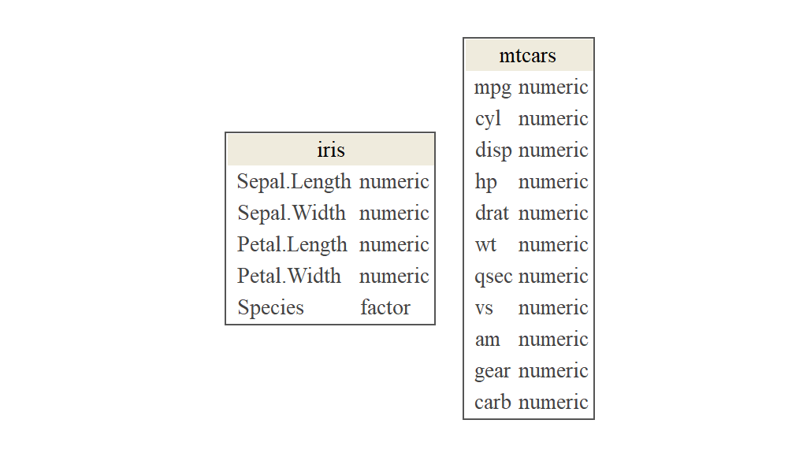

# `template.project`

<!-- badges: start -->

[](https://travis-ci.org/data-science-competitions/template.project)
[](https://codecov.io/github/data-science-competitions/template.project/?branch=master)
[](https://mybinder.org/v2/gh/data-science-competitions/template.project/master?urlpath=rstudio)
<!-- badges: end -->

R Project Template for Analytic Applications such as Machine Learning
Competitions

-----


<!-- Package Description -->

## Overview

Using this template reduces:  
\* Unnecessary variance between projects configurations; and  
\* Development time spent on making a barebone project working for the
first time.  
This is possible as the boilerplate comes with:  
\* Fully configured test-suite, including code-coverage; and  
\* Fully configured continuous-integration (CI) script for Travis.

<!--- Only relevant for the {boilerplate} package -->

## Useage

1.  Create a new repo on GitHub.
2.  Use the
    [`git-flow`](https://blog.sourcetreeapp.com/2012/08/01/smart-branching-with-sourcetree-and-git-flow/)
    approach in your development cycle.
3.  Create a new release named `inception`.
4.  Copy `template.project` content to the new reposetory.
5.  Change the `template.project.Rproj` file to `<package-name>.Rproj`.
6.  Open the `DESCRIPTION` file, and edit the following fields:
7.  **Package** modify the package name while using the `tidylab.`
    prefix.
8.  **Title** modify the package title; use uppercase words with no
    period (‘.’).
9.  **URL** modify the package URL such that it leads to its GitHub
    repo.
10. **BugReports** edit the URL such that it leads to the package issue
    page.
11. **Description** modify the package decription.
12. In `README.Rmd` delete the **Useage** Section.
13. Render `README.Rmd` by clicking the **Knit** button.
14. Push changed on the `inception` branch.
15. Go to [Travis website](https://travis-ci.org/account/repositories),
    add the project and enable its integration.

## Installation

You can install `template.project` by using:

    install.packages("devtools")
    devtools::install_github("data-science-competitions/template.project")

## Data Pipeline

The template includes a database abstraction layer (DAL) that separates
data sources and analytic applications. The DAL has 3 stages with the
following functionality:

1.  `Ingest`

<!-- end list -->

  - Pull data from external sources; and
  - Matching schema, organizing, indexing, encoding and compressing the
    data.

<!-- end list -->

2.  `Prepare`

<!-- end list -->

  - Type conversion of variables if necessary; and
  - Data cleansing;

<!-- end list -->

3.  `Store`

<!-- end list -->

  - Create a data model if relational tables exist;
  - Introduce new features and ready-for-modelling tables;
  - Make the data available for query.

The template provides skeletons for `Ingest`, `Prepare` and `Store`
interfaces. In addition, the template includes a data flow demonstration
that implements all three interfaces with a toy dataset.

``` r
ingest_interface <- Ingest$new(path = tempdir())
class(ingest_interface)
```

    ## [1] "Ingest" "R6"

``` r
ingest_object <- IngestDAO$new(path = tempdir())
class(ingest_object)
```

    ## [1] "IngestDAO" "Ingest"    "R6"

<!--
## Function Dependencies


-->

## Datasets

### Data Overview



### Data Glimpse

    ## Observations: 22
    ## Variables: 11
    ## $ mpg  <dbl> 21.0, 21.0, 22.8, 21.4, 18.7, 18.1, 14.3, 24.4, 22.8, 19.2, 17.8, 16.4, 17.3, 15.2...
    ## $ cyl  <dbl> 6, 6, 4, 6, 8, 6, 8, 4, 4, 6, 6, 8, 8, 8, 8, 8, 8, 4, 4, 4, 4, 8
    ## $ disp <dbl> 160.0, 160.0, 108.0, 258.0, 360.0, 225.0, 360.0, 146.7, 140.8, 167.6, 167.6, 275.8...
    ## $ hp   <dbl> 110, 110, 93, 110, 175, 105, 245, 62, 95, 123, 123, 180, 180, 180, 205, 215, 230, ...
    ## $ drat <dbl> 3.90, 3.90, 3.85, 3.08, 3.15, 2.76, 3.21, 3.69, 3.92, 3.92, 3.92, 3.07, 3.07, 3.07...
    ## $ wt   <dbl> 2.620, 2.875, 2.320, 3.215, 3.440, 3.460, 3.570, 3.190, 3.150, 3.440, 3.440, 4.070...
    ## $ qsec <dbl> 16.46, 17.02, 18.61, 19.44, 17.02, 20.22, 15.84, 20.00, 22.90, 18.30, 18.90, 17.40...
    ## $ vs   <dbl> 0, 0, 1, 1, 0, 1, 0, 1, 1, 1, 1, 0, 0, 0, 0, 0, 0, 1, 1, 1, 1, 0
    ## $ am   <dbl> 1, 1, 1, 0, 0, 0, 0, 0, 0, 0, 0, 0, 0, 0, 0, 0, 0, 1, 1, 1, 0, 0
    ## $ gear <dbl> 4, 4, 4, 3, 3, 3, 3, 4, 4, 4, 4, 3, 3, 3, 3, 3, 3, 4, 4, 4, 3, 3
    ## $ carb <dbl> 4, 4, 1, 1, 2, 1, 4, 2, 2, 4, 4, 3, 3, 3, 4, 4, 4, 1, 2, 1, 1, 2
